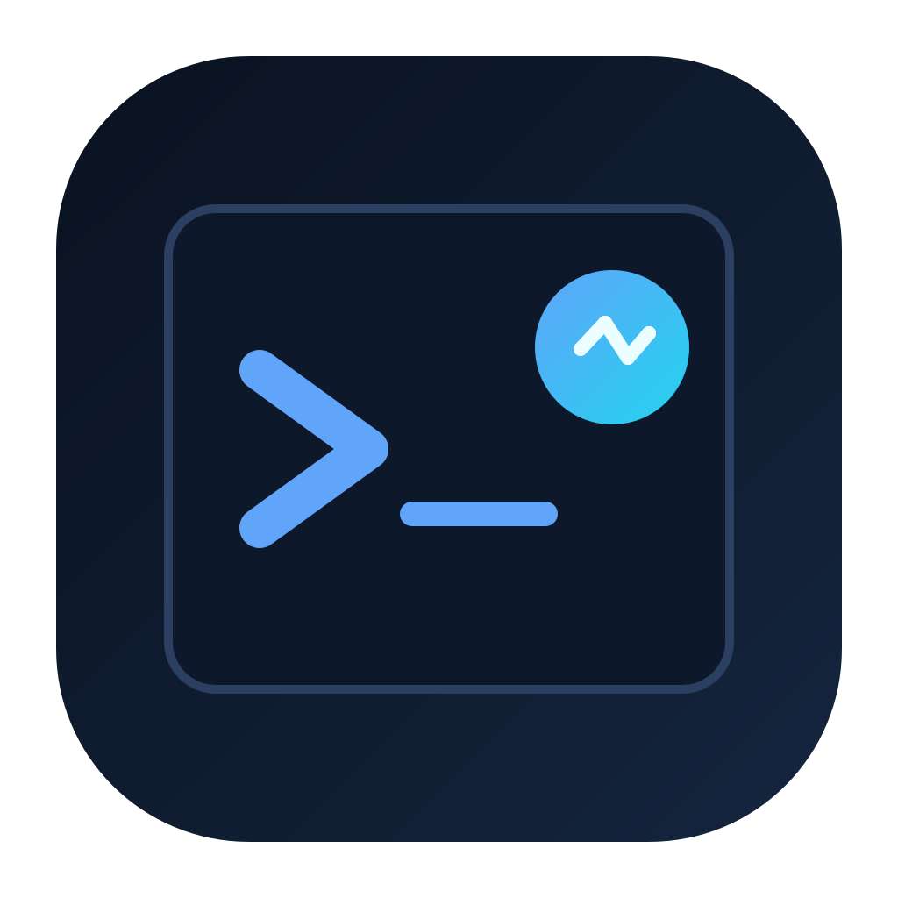

# SmartShell



SmartShell is an Electron desktop app with:
- A real PTY terminal on the left
- An AI assistant on the right
- Shared context between them, so the assistant can explain what just happened in your shell

## Features

- Full interactive terminal (`node-pty` + `xterm.js`)
- Streaming AI chat responses
- Terminal-aware context (recent commands + output are appended to the system prompt)
- LLM source switching:
  - Local OpenAI-compatible endpoint (Ollama, LM Studio, vLLM, etc.)
  - OpenAI Codex via OAuth sign-in
  - Gemini via API key (Google OpenAI-compatible endpoint)
- Assistant behavior modes:
  - `Respond when prompted` (manual chat only)
  - `Respond automatically` (assistant auto-comments on completed terminal output)
  - `Auto-run commands` (UI placeholder, not implemented)
- Configurable system prompt from settings

## Requirements

- Node.js 18+
- npm
- Build prerequisites for native `node-pty`

Full dependency install (Debian/Ubuntu):

```bash
sudo apt update
sudo apt install -y nodejs npm build-essential python3 make g++
```

If using a local model server (Ollama etc.), run it separately and ensure it exposes OpenAI-compatible endpoints.

## Install

```bash
npm install
```

`postinstall` automatically rebuilds `node-pty` for Electron.
If native module errors appear, run:

```bash
npm run rebuild
```

## Run

Normal:

```bash
npm start
```

Development (with DevTools):

```bash
npm run dev
```

Package macOS `.dmg`:

```bash
npm run build
```

## Provider Setup

### 1. Local API Endpoint (Ollama/LM Studio/vLLM)

1. Start your local server (for Ollama: `ollama serve`)
2. Ensure at least one model is available (for Ollama: `ollama pull <model>`)
3. In SmartShell settings (`⚙`), select `Local API Endpoint`
4. Enter server URL (for Ollama default: `http://localhost:11434`)
5. Click `Fetch Models`, choose a model, then save

### 2. OpenAI Codex (OAuth)

1. In settings (`⚙`), select `OpenAI Codex`
2. Click `Sign in with OpenAI` and finish OAuth in browser
3. Choose a model and save

Current built-in Codex model list:
- `gpt-5.3-codex`
- `gpt-5.2-codex`
- `gpt-5.1-codex-max`
- `gpt-5.1-codex-mini` (default)
- `gpt-5.2`

### 3. Gemini (API Key)

1. Create a Gemini API key in Google AI Studio
2. In settings (`⚙`), select `Gemini API Key`
3. Paste your key
4. Click `Fetch Models`
5. Choose a fetched model and save

## Configuration

`config.yaml` is loaded from project root. If missing, defaults are used.

Start from:

```bash
cp config.default.yaml config.yaml
```

Example:

```yaml
llm:
  source: "local"                  # "local" | "openai" | "gemini"
  url: "http://localhost:11434"    # used for local source
  model: "llama3.2"

terminal:
  shell: ""                        # empty = $SHELL
  fontSize: 14
  fontFamily: "Cascadia Code, Fira Code, Consolas, monospace"

context:
  maxEntries: 10
  maxOutputChars: 2000

assistant:
  mode: "prompted"                 # prompted | automatic | autorun

systemPrompt: ""                   # empty = built-in default
```

## How Context Works

- Keystrokes are tracked to detect command boundaries.
- Terminal output is cleaned (ANSI/OSC stripped) and attached to the command.
- A rolling buffer of recent entries is injected into the system prompt on each request.

In `Respond automatically` mode, SmartShell also triggers proactive assistant comments when new command output is finalized.

## Notes

- `config.yaml` is gitignored and may contain local OAuth tokens.
- `nodeIntegration` is enabled in the renderer; do not load untrusted content.
